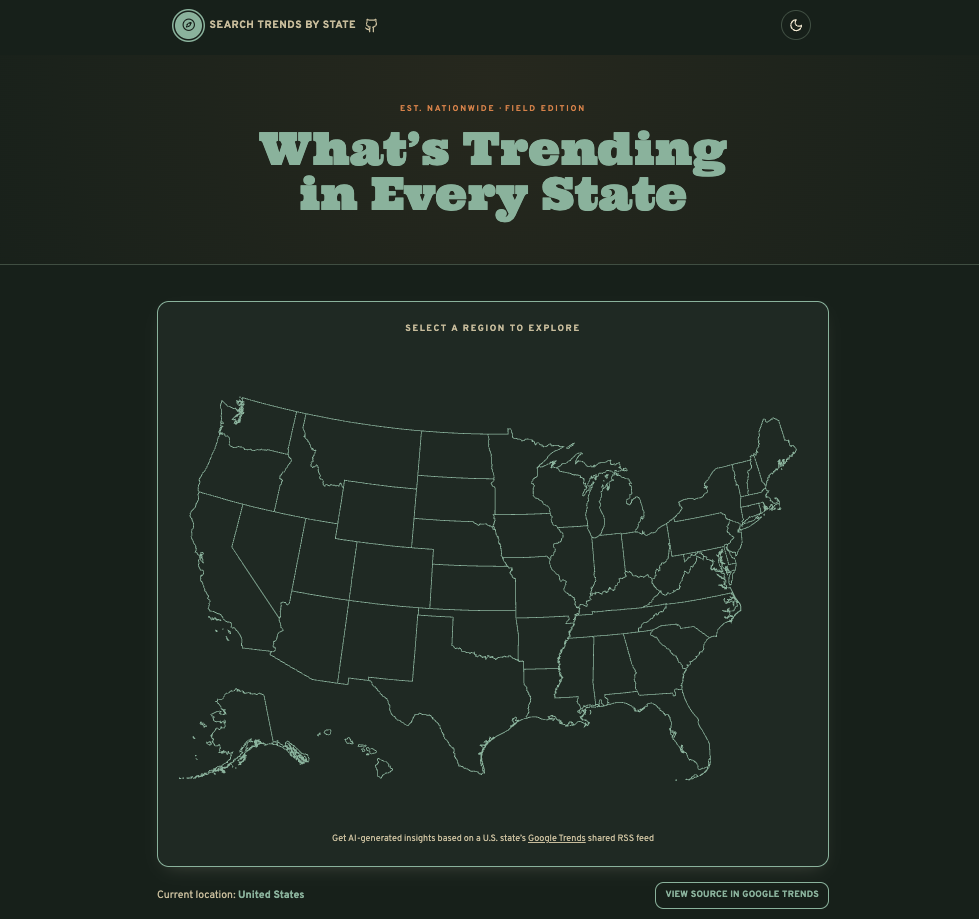

# Search by State Trends



An interactive US map that shows what's trending on Google in any state, summarized by Claude.

## What it does

1. Click a state on the map.
2. The app fetches that state's real-time Google Trends feed.
3. Claude (Anthropic API) reads the trends and generates a short, plain-language summary.
4. Raw trends and the AI summary are shown side by side.

No database, no auth, no persistent storage — just a live lookup against Google Trends and a Claude call for the summary.

## Tech stack

- **Next.js** (App Router, API routes) + React
- **Google Trends** RSS/XML export, parsed server-side
- **Claude API** (Anthropic) for trend summaries
- **react-simple-maps** for the US map
- **Tailwind CSS** for styling
- **Vitest** for tests

## Getting started

```bash
git clone https://github.com/dfrho/trends-summary.git
cd trends-summary
npm install
```

Set up your environment variables:

```bash
cp .env.example .env.local
```

Then edit `.env.local` and add your Anthropic API key:

```bash
ANTHROPIC_API_KEY=sk-ant-your-actual-api-key
```

Run the dev server:

```bash
npm run dev
```

Open [http://localhost:3000](http://localhost:3000).

## Testing

```bash
npm test        # run once
npm run test:watch
```

## Use cases

- Quick conversation starters when meeting people from other states
- A pulse check on regional news, weather, or events
- Region-specific insights for content or marketing

## Contributing

Contributions are welcome — feel free to open a Pull Request.

## License

MIT — see [LICENSE.md](LICENSE.md).

## Disclaimer

Not affiliated with, endorsed by, or sponsored by Google. Uses publicly available data from Google Trends' client-exported RSS feed.
